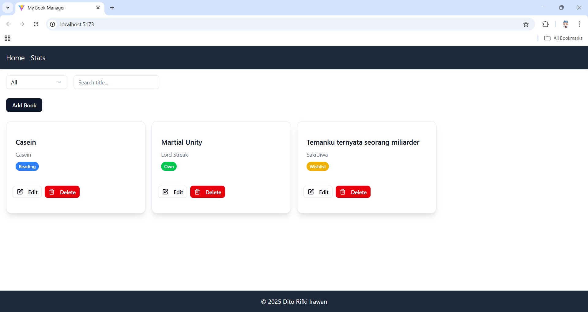
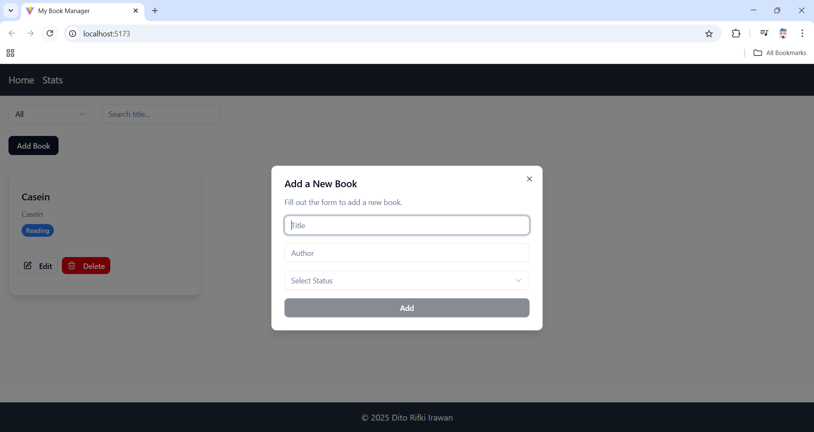
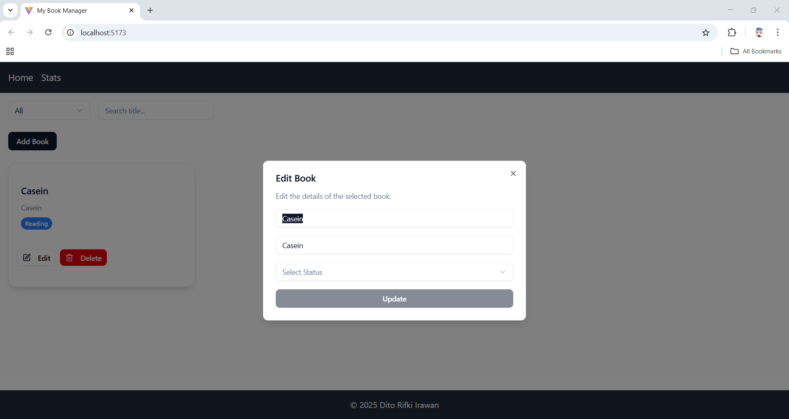
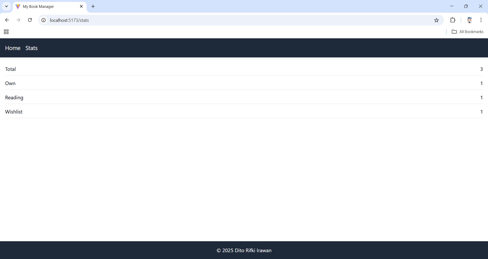
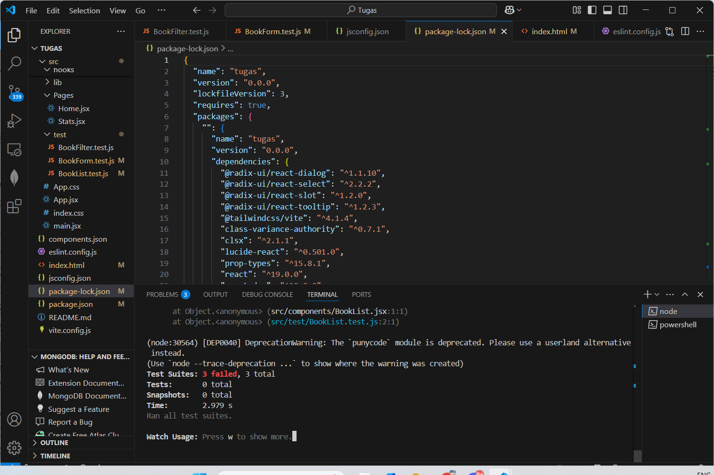

# React Book Management App

Aplikasi manajemen buku berbasis **React JS** yang memungkinkan pengguna untuk menambah, mengedit, dan menghapus buku dari koleksi mereka. Aplikasi ini menggunakan React Hooks untuk pengelolaan state dan React Context untuk state global.

## Deskripsi Aplikasi

Aplikasi ini dirancang untuk mengelola koleksi buku, memungkinkan pengguna untuk:
- **Menambah buku baru** dengan informasi judul, penulis, dan status.
- **Mengedit informasi buku** yang ada.
- **Menghapus buku** dari daftar.
- **Memfilter buku** berdasarkan status (misalnya: "Own", "Reading", "Wishlist").
- **Mencari buku** berdasarkan judul.

### Fitur Aplikasi:
- **Menambah Buku**: Form untuk menambah buku baru.
- **Mengedit Buku**: Pengguna dapat mengedit informasi buku yang ada.
- **Menghapus Buku**: Tombol untuk menghapus buku yang dipilih.
- **Memfilter Buku**: Fitur filter berdasarkan status buku.
- **Pencarian Buku**: Fitur pencarian berdasarkan judul buku.

### Aplikas
[Aplikasi](https://dito-122140153-pertemuan3.vercel.app)

### Screenshot Aplikasi:

